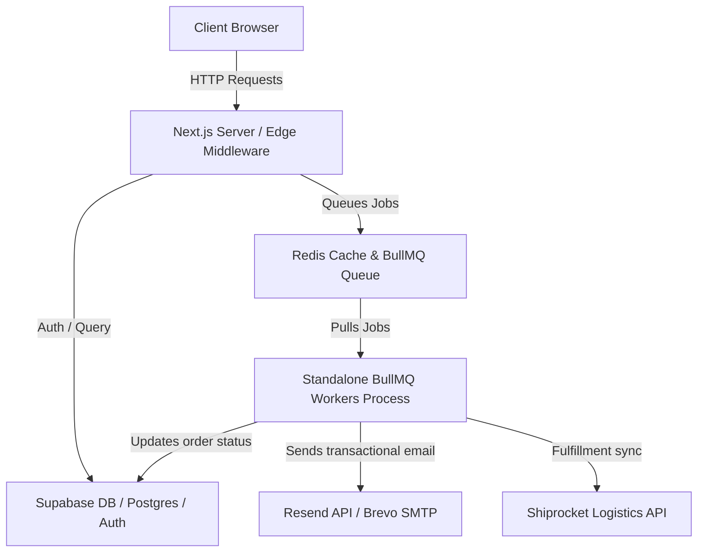
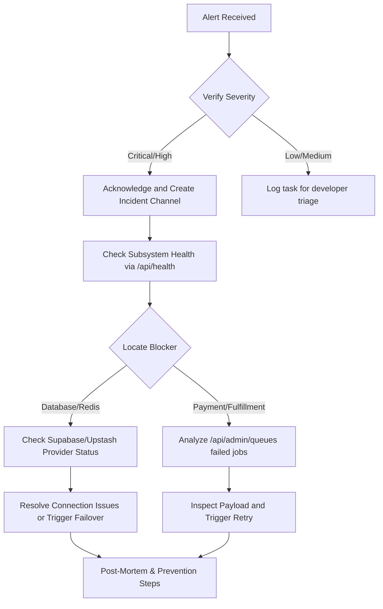

# Stitch 6K — Operations, Monitoring, & Recovery Manual

This operations manual defines the architecture, deployment protocols, rollback procedures, health monitoring configurations, queue operations, incident response workflows, and disaster recovery processes for the Stitch 6K ecommerce platform.

---

## 1. System Architecture Overview

Stitch 6K is a high-availability Next.js ecommerce system structured for separation of concerns and high transactional reliability:



* **Frontend/API Core**: Next.js App Router deployed on serverless/VPS, using edge middleware for rate limiting and CSRF protection.
* **Background Worker Processing**: Standalone Node.js process executing background tasks (email dispatch, Shiprocket dispatches, loyalty processing) asynchronously via BullMQ on Redis.
* **Storage & database**: Postgres database provided by Supabase, asset hosting and image optimization managed by Cloudinary.

---

## 2. Environment Variables

All keys must be securely mapped to host configurations. Do not commit actual values to the repository.

| Category | Key | Description / Type |
| :--- | :--- | :--- |
| **Supabase** | `NEXT_PUBLIC_SUPABASE_URL` | Supabase endpoint URL |
| | `NEXT_PUBLIC_SUPABASE_ANON_KEY` | Public client token |
| | `SUPABASE_SERVICE_ROLE_KEY` | Secret server key bypassing RLS |
| **Razorpay** | `NEXT_PUBLIC_RAZORPAY_KEY_ID` | Client checkout key |
| | `RAZORPAY_KEY_SECRET` | Secret key for verification |
| | `RAZORPAY_WEBHOOK_SECRET` | Secret webhook verification token |
| **Logistics** | `SHIPROCKET_EMAIL` | Account email for credentials |
| | `SHIPROCKET_PASSWORD` | Account password for token generation |
| | `SHIPROCKET_WEBHOOK_TOKEN` | Auth header token verification |
| **BullMQ / Cache** | `REDIS_URL` | Redis URL endpoint |
| | `UPSTASH_REDIS_REST_URL` | Edge rate limiting URL |
| | `UPSTASH_REDIS_REST_TOKEN` | Edge rate limiting token |
| **Email** | `RESEND_API_KEY` | API token for Resend client |
| | `BREVO_SMTP_USER` | SMTP username fallback |
| | `BREVO_SMTP_PASS` | SMTP password fallback |

---

## 3. Deployment Checklist

Before rolling out new changes to staging or production, execute this checklist step-by-step:

1. **Local Integration Verification**
   - Run type checker: `npx tsc --noEmit`. Must compile with 0 errors.
   - Run production compiler: `npm run build`. Must complete successfully.
2. **Database Migrations**
   - Apply any pending schema updates from `supabase/migrations/` in sequential order using the Supabase CLI or SQL editor.
   - Verify that unique constraints, indexes, and database RPC functions (`atomic_claim_payment`) are present.
3. **Services Pre-check**
   - Verify connectivity to Redis, Razorpay, Shiprocket, and Resend.
   - Ensure the server is provisioned with `IS_WORKER=false` (Next.js server) and worker servers have `IS_WORKER=true` (Standalone workers).
4. **Environment Propagation**
   - Confirm all production keys listed in the **Environment Variables** section are synced to Vercel/VPS.
5. **Deployment Command**
   - Trigger deployment to target environment (e.g. `git push origin main` or via Vercel CLI).

---

## 4. Rollback Procedure

If the deployment causes critical application errors, service degradation, or payment disruptions, execute the rollback immediately:

1. **Identify the Last Stable Commit**
   - Run `git log` or check GitHub releases to locate the last stable tag (e.g. `v1.1-phase2-stable`).
2. **Rollback Git State**
   - Deploy the stable commit using:
     ```bash
     git checkout v1.1-phase2-stable
     git push origin main --force
     ```
3. **Database Schema Rollback**
   - If migrations included breaking modifications, run the corresponding down-migrations to restore schema compatibility immediately.
4. **Verification**
   - Verify the restoration by calling the aggregated system health endpoint: `/api/health`.

---

## 5. Monitoring & Operational Alerting

### Health Check Endpoints
We expose dedicated endpoints returning standardized JSON status checks:

* `/api/health` — Combined status of all systems (returns 200 OK or 503 Degraded).
* `/api/health/database` — Supabase client ping & latency check.
* `/api/health/redis` — Redis client ping & latency check.
* `/api/health/email` — Credentials and REST ping validation for Resend/Brevo.
* `/api/health/shiprocket` — Credential validation and endpoint ping test.
* `/api/health/storage` — Cloudinary API availability check.

### Alerting Actions
If any subsystem changes state to `unhealthy`, the alerting framework logs a critical warning:
`🚨 [ALERT] [CRITICAL] Subsystem database is unhealthy`

This message is captured by Sentry and will immediately trigger an email alert/Slack webhook to the active operational on-call developer.

---

## 6. Queue Operations & Control Guide

Manage background jobs and queue states via the Admin Portal at `/admindashboard/operations` or using CLI controls:

### Pausing and Resuming Queues
* To prevent workers from pulling new jobs during down-stream outages (e.g., if Shiprocket API goes down), pause the corresponding queue (`shipment-sync` or `shipment-retry`) in the Admin Operations panel. This calls `queue.pause()` atomically.
* Once the downstream dependency recovers, click **Resume Queue** to reactivate processing.

### Retrying Failed Jobs
* Inspect failed job payloads and stack traces inside the Operations UI.
* Click **Retry** on any failed job to move it back to the `waiting` state, where it will be picked up by the next available worker.
* Click **Cancel** to remove stuck or obsolete jobs from Redis.

---

## 7. Incident Response Workflow

When an alert is received, follow the incident playbook:



---

## 8. Disaster Recovery & Data Backups

### Supabase Database Backups
* **Daily Backups**: Supabase automatically captures daily database snapshots.
* **Point-in-Time Recovery (PITR)**: Production utilizes PITR, allowing restoration of the database to any specific second in the past 7 days.
* **Manual Export**: If a manual backup is required before breaking database schema updates, export schema and data using:
  ```bash
  supabase db dump --data-only > pre_deployment_data.sql
  ```

### Redis Cache & Queue Recovery
* **AOF (Append Only File) Persistence**: Redis is configured with `appendonly yes` and `appendfsync everysec`.
* **Queue Re-synchronization**: In the event of a total Redis cache loss, BullMQ queues will be initialized empty. The `sweep_pending_payments` repeatable job (every 15m) will query the database for stuck orders and automatically re-enqueue processing tasks, healing queue state without data loss.

---

## 9. Troubleshooting Guide

### 1. Redis Connection Failures
* **Symptoms**: Background workers failing with `ECONNREFUSED` or logs print `Redis connection error`.
* **Remedy**:
  1. Verify the status of Upstash or the self-hosted Redis container.
  2. Ensure the `REDIS_URL` matches the required authentication credentials (`redis://:password@host:port`).
  3. Verify that `maxRetriesPerRequest` is set to `null` on all BullMQ workers.

### 2. Slow DB Queries / Timeout Errors
* **Symptoms**: Latency checks on `/api/health/database` exceed 500ms or print SQL transaction timeouts.
* **Remedy**:
  1. Confirm that all foreign key indexes created in `supabase/migrations/20260718010000_phase3_performance.sql` are active.
  2. Check the Supabase API limits console to verify if database connections are exhausted.

### 3. Payment Processing Webhook Backlog
* **Symptoms**: Success rate metrics drop, orders remain in `Payment Pending` state despite customer payments.
* **Remedy**:
  1. Check the `payment-processing` queue counts via the Operations Dashboard.
  2. If jobs are stuck in `failed`, inspect the failure reason (e.g. concurrency lock, Razorpay signature mismatch) and trigger a bulk retry.
